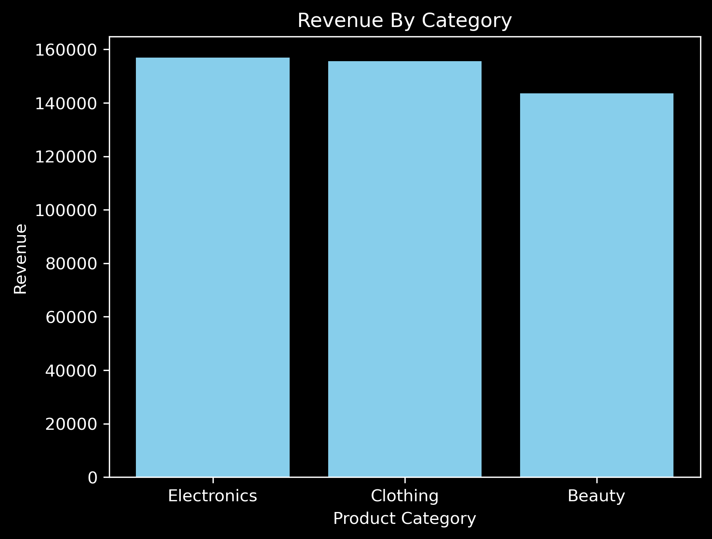
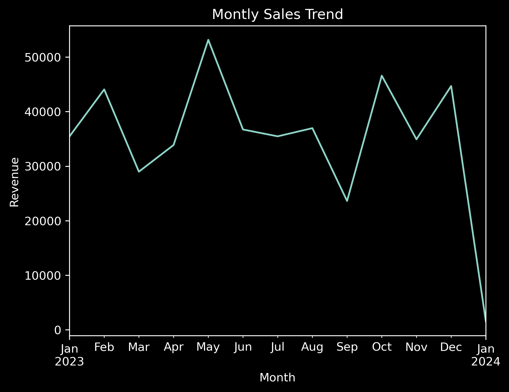

# Retail_Dataset_Analysis 
In this project, I analyzed retail dataset to identify top performing products, monthly sales trends, and customer retention metric using SQL and python(pandas, matplotlib) and SQL. This analysis could help retailers improve inventory and sales strategy.

## Buisness Problem
What product categories drive the highest revenue, and how can we optimize inventory and sales strategies?  

## Methods used
- **Tools:** SQL, Python (Pandas, Matplotlib), Jupyter Notebook.  
- **Data Cleaning:** Handled missing/null values, converted data types.  
- **Analysis:** Aggregated revenue by category and month.  

##  Key Insights  

### 1. Top Product Category by Revenue

```sql
SELECT Product_Category , SUM(Total_Amount) AS Total_Revenue
FROM retail_sales_dataset
GROUP BY Product_Category
ORDER BY Total_Revenue DESC
LIMIT 10;
```
(Assuming the currency is USD)
- Electronics generated $156,905 (highest revenue).  
- Clothing generated $155,580.  
- Beauty generated $143,515(lowest revenue).  

### 2. Sales Trends Over Time  
```python
retail_df['Date'] = pd.to_datetime(retail_df['Date'])
retail_df['Month'] = retail_df['Date'].dt.to_period('M')
Monthly_Revenue = retail_df.groupby('Month')['Total Amount'].sum().sort_values(ascending=False)
Monthly_Revenue
```
- Sales peaked in **May** (highest sales).  
- Lowest sales occurred in **January** .


### 3. Top Product Category by Quantity
```sql
SELECT Product_Category , SUM(Quantity) AS Total_Quantity
FROM retail_sales_dataset
GROUP BY Product_Category
ORDER BY Total_Quantity DESC
LIMIT 10;
```
- 894 Clothing products.
- 849 Electronics products.
- 771 Beauty products.

### 3. Revenue vs Quantity Sold  
- Electronics: Highest revenue and high quantity.  
- Beauty products: Lowest revenue and less quantity.  

### 4. Top Customers  
- Top 5 customers with the highest purchase.
```sql
SELECT Customer_ID , MAX(Total_Amount) AS Highest_Purchase
FROM retail_sales_dataset
GROUP BY Customer_ID
ORDER BY Highest_Purchase DESC
LIMIT 5;
```
  - 1.CUST015
  - 2.CUST074
  - 3.CUST065
  - 4.CUST089
  - 5.CUST072

## Optimize Inventory
  - Stock more of electronics for higher revenue. 
  - Run promotions in january(low sales month).
    
##  Visualizations  
   
 
